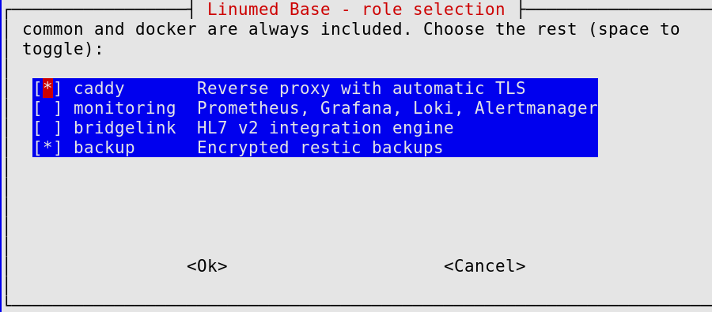

# Linumed Base

[](LICENSE)

Ansible-based IaC kit that turns a standard Debian 13 installation into a
hardened, GDPR-aware healthcare infrastructure platform.
On-premise by design. FOSS only.

[linumed.com/base](https://linumed.com/base/)

---

## What it is

Linumed Base is not a custom Linux distribution. It is a collection of
Ansible playbooks and roles that configure a standard Debian 13 (Trixie)
server into a production-ready healthcare infrastructure stack - including
HL7 v2 integration, monitoring, reverse proxy, and encrypted backups.

## What it includes

| Component | Role |
|---|---|
| Debian 13 hardening | SSH, ufw, fail2ban, unattended-upgrades |
| Caddy | Reverse proxy with automatic TLS |
| BridgeLink | HL7 v2 integration engine (MPL-2.0 fork of Mirth Connect). FHIR endpoints can be built as HTTP/JSON channels; no FHIR data type ships with the engine - see [docs/roles/bridgelink.md](docs/roles/bridgelink.md) |
| Prometheus + Grafana + Loki + Alertmanager | Observability stack (log shipping via Grafana Alloy, host metrics via native Node Exporter, optional BridgeLink channel metrics) |
| restic | Encrypted backups |

## What it deliberately does not do

Stated up front, because the fastest way to evaluate a kit is to find out early whether it
is the wrong one. Each of these is a recorded decision with its reasoning, not an omission:

- **No Kubernetes.** Service stacks are Docker Compose on a single host. Kubernetes solves
  scheduling and load distribution across nodes; this kit deploys a small, fixed set of
  infrastructure services on one machine, where there is nothing to schedule. It also
  fails the criterion every other addition here is held to - a cluster is a subsystem the
  institution has to supply, and this kit has to work after the playbook runs, on a machine
  you already have. **The cost is real and worth knowing: one host means no high
  availability.** [ADR 0007](docs/adr/0007-docker-compose-not-kubernetes.md).

  If you run Kubernetes, half of this kit is still yours: `common` (SSH hardening, ufw,
  fail2ban, unattended-upgrades, NTP), `docker` and `backup` are runtime-agnostic and work
  on the nodes under your cluster. Only `caddy`, `monitoring` and `bridgelink`
  are Compose-coupled. That subset has its own playbook -
  `ansible-playbook playbooks/node-baseline.yml` - which is applied to a fresh VM on every
  relevant change and checked for effect, not just for exit code.

- **No bundled identity provider, and no admin interface on the public internet.** Every
  management UI binds to `127.0.0.1` and is reached through an SSH tunnel. Grafana can be
  connected to an identity provider you *already* run, via OIDC; this kit does not ship one.
  [ADR 0003](docs/adr/0003-loopback-only-access-no-bundled-identity-provider.md).

- **No application software.** No HIS, no DMS, no document management. Institutions bring
  their own applications; this provides the base they run on.

- **No proprietary components.** FOSS only - which is why the integration engine is
  BridgeLink and not Mirth Connect, after the latter went proprietary in March 2025.
  [ADR 0001](docs/adr/0001-bridgelink-statt-mirth-connect.md).

Every decision that is likely to prompt a "why not X?" is written down under
[docs/adr/](docs/adr/), with the alternatives that were evaluated and the consequences
accepted.

## Status

**`v2.0.0` is tagged** - see [CHANGELOG.md](CHANGELOG.md). From here, the surface
ADR 0008 names (role variable names, deploy paths, container/network names, this kit's
own metric and alert names, dashboard/datasource UIDs, systemd unit names) is covered by
a stability guarantee: a breaking change to any of it requires a major version bump. Six
roles now, not seven - Orthanc shipped in `v1.0.0` and was removed a week later
([ADR 0011](docs/adr/0011-orthanc-removed-not-part-of-base.md)); see
[docs/operations/orthanc-recommendation.md](docs/operations/orthanc-recommendation.md)
if you're looking for a DICOM server. Every role passed a full
`site.yml` double-run against a throwaway VM (idempotent - `changed=0` on the second run)
and, separately, against a real Debian 13 netinst/preseed install via
`scripts/bootstrap.sh` and `test/vm-test-netinst.sh` (issues #13/#14). That double-run now
happens in CI on every change under `ansible/`, `docker/`, `test/` or `scripts/`, not only
when someone remembers to start it (#45). The onboarding path itself is checked too, run
before releases rather than on every push: `test/vm-test-quickstart.sh` executes this
quick start section verbatim - clone, copy the example inventory, select roles, fill in
the vault, deploy - and is what actually caught the two defects fixed in issue #106 that
this same paragraph used to claim were already covered by `vm-test-netinst.sh` alone (they
were not: that script never clones, never runs `select-roles.sh`, never touches
`vault.yml`). Not part of regular CI for the same reason `vm-test-netinst.sh` isn't - a
real installer run is slow - so it stays a manual, pre-release check rather than a claim
about every commit.

The full plan, in order, with the reasoning behind the sequencing:
[`docs/ROADMAP.md`](docs/ROADMAP.md).

## Requirements

- Target: Debian 13 (Trixie), bare metal or VM
- Control node: any Linux machine with Ansible installed
- SSH access to the target host

### System requirements by stack

Measured, not estimated: each row is a real `site.yml` (or role subset) deployment
against a fresh Debian 13 VM, RAM/CPU sized down until it still deployed cleanly, then
measured after a 2-5 minute settle period so short-lived install-time spikes don't
inflate the number. `free -m` "used" (not "available") is what's reported - it's the
number that predicts whether the next role you add will fit.

**Recommended for a real deployment: at least 2 vCPUs, 3 for the full stack** - a busy
first apply (package installs, image pulls) is visibly slower on a single core, and this
repo has already chased down enough hard-to-reproduce timing issues during real testing
(see `ansible/roles/docker/README.md` and `ansible/roles/common/README.md`, "become: true
on every privileged task" / "Stolperfallen" for the specific bug this repo already found
and fixed once) to not want to reintroduce that risk on a production host to save one
vCPU. `test/vm-test.sh` itself runs with 3 for exactly that reason. The vCPU column below
is the measured floor each stack still deploys on, not a target to build toward.

| Stack | RAM (allocated / used) | vCPUs (measured floor) | Disk (used) | Notes |
|---|---|---|---|---|
| common + docker + caddy | 1 GB / 381 MB | 1 | 1.6 GB | Minimum that deploys cleanly - no headroom for anything else |
| + monitoring | 2 GB / 903 MB | 2 | 4.6 GB | Prometheus, Grafana, Loki, Alloy, Alertmanager, cAdvisor, native Node Exporter |
| Full stack (+ bridgelink + backup) | 1.5 GB / 1.3 GB | 2 | 7.0 GB | Minimum that deploys cleanly. 1 GB fails outright - BridgeLink's JVM never finishes starting |
| Full stack, comfortable | 6 GB / 1.9 GB | 3 | 7.0 GB | What `test/vm-test.sh` uses - headroom for image pulls, restic runs, and Grafana/cAdvisor's own usage variance |

A few things worth knowing before sizing a real host:

- **BridgeLink dominates RAM once channels are added.** These numbers are an empty
  engine (`bridgelink_max_heap_mb: 512` default) with no channels configured - real HL7
  traffic and channel-side JavaScript transformers use more. Size the JVM heap for your
  actual channel load, not this baseline.
- **This table used to have a seventh role, Orthanc, and a "no imaging" row next to it.**
  Orthanc was removed from this kit in #92/[ADR 0011](docs/adr/0011-orthanc-removed-not-part-of-base.md) -
  see [docs/operations/orthanc-recommendation.md](docs/operations/orthanc-recommendation.md)
  if you're looking for a DICOM server. The "Full stack" row above is the six-role
  measurement from that same re-measurement pass (issue #84); the "comfortable" row
  reuses the prior seven-role comfortable figure rather than a fresh VM cycle, since
  every measurement in that pass showed Orthanc moving RAM by well under 50 MB.
- **The rows are not all from the same measurement pass, and the disk figures show it.**
  The two "Full stack" rows were measured on 2026-08-22/23; the two rows above them date
  from the original pass and have not been re-run since. Orthanc turned out not to move
  disk at all - six roles and seven both measured 6983 MB - so the jump from the 6.0 GB
  this table used to claim to today's 7.0 GB is the *other* images growing between the
  two passes, not a role being added. Expect the same drift in the unrefreshed rows, and
  treat all four as a floor with a margin rather than a current inventory.

- **The optional BridgeLink exporter is not in these numbers.** Enabling
  `bridgelink_exporter_enabled` adds one more container (a pinned `python:3.13.15-alpine`
  running a standard-library script, no extra image built by this repo). Small next to the
  JVM, but it is one container and one image more than the table was measured with.
- **`/var/lib/docker/volumes` starts small and grows.** 51-100 MB here is a fresh
  install; Loki and Prometheus retention (30/90 days by default, see
  `docs/roles/monitoring.md`) and BridgeLink's message storage are what actually
  consumes disk over time - budget accordingly, not from this table.

## Quick start

On a **freshly installed Debian 13 minimal/netinst** target, `python3` and `sudo` aren't
guaranteed to be present - run `scripts/bootstrap.sh` on the target first (see
`scripts/README.md`). Skip this if the target already has a working sudo user (e.g. any
cloud image, or a host you've set up before).

The target itself has no `git` at this point, so clone on your own machine first and copy
just the script over:

```bash
git clone https://github.com/Linumed/Base.git
cd Base

scp scripts/bootstrap.sh root@<target>:~
ssh root@<target> ./bootstrap.sh --user <username> --key "ssh-ed25519 AAAA... you@host"
# <username> is whatever you want the sudo-capable user to be called - it does not have
# to be "linumed". Whatever you pick here has to match ansible_user in hosts.yml below.
```

```bash
cd ansible
# Every ansible-playbook/ansible-vault/ansible-lint command in this repo runs from here,
# not the repo root - ansible.cfg (roles_path, default inventory) lives in this
# directory and Ansible only picks up an ansible.cfg from the current working directory.

cp -r inventory/example inventory/myhospital
# "myhospital" is an example name for this inventory directory, not a required one -
# call it whatever you like (a customer name, a site name). Whatever you pick here is
# what every path below reads back, so keep using the same name once you've chosen it.
# edit inventory/myhospital/hosts.yml: set ansible_host / ansible_user for your target

# inventory/myhospital/group_vars/linumed/vars.yml holds plain config (edit
# backup_repository at least). Pick optional roles here too - by hand, or via the
# whiptail checklist below:
../scripts/select-roles.sh --file inventory/myhospital/group_vars/linumed/vars.yml
```



`common` and `docker` are always included; the checklist only covers the four optional
roles. See `scripts/README.md` for the non-interactive form used by CI and scripted
onboarding.

```bash
# .../vault.yml.example lists six secrets with no safe default; all of them abort
# site.yml outright once their role is selected. Turn it into a real, encrypted vault
# file:
cp inventory/myhospital/group_vars/linumed/vault.yml.example \
   inventory/myhospital/group_vars/linumed/vault.yml
# edit vault.yml, replace every CHANGEME, then encrypt it:
ansible-vault encrypt inventory/myhospital/group_vars/linumed/vault.yml

ansible-playbook playbooks/site.yml -i inventory/myhospital --ask-vault-pass
# Add --ask-become-pass, unless bootstrap.sh ran with --nopasswd. Note that
# --ask-become-pass only works if <username> HAS a login password: bootstrap.sh never
# sets one on its own, so the account is locked by default. Set one yourself first
# (passwd <username>, as root on the target) - see scripts/bootstrap.sh's own output.
```

## Documentation

See [ARCHITECTURE.md](ARCHITECTURE.md) for design decisions and component details.

## Reporting a security problem

Privately, by email, never as a public issue - see [SECURITY.md](SECURITY.md) for the
address, what to include, what response times this project can realistically promise,
and what is in scope here versus belonging upstream.

## License

MIT - see [LICENSE](LICENSE)

## Part of the Linumed ecosystem

- **Linumed Base** (this repo) - open source infrastructure platform
- **Linumed Shifts** - nurse shift scheduling SaaS (commercial)

[linumed.com](https://linumed.com)
